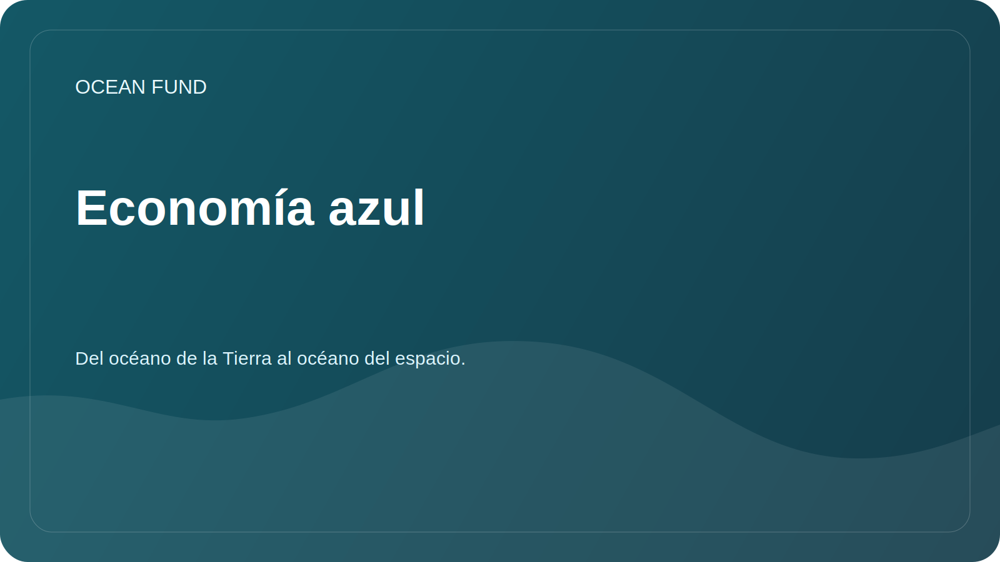

# Economía azul

## Enfocar

La Ocean Foundation utiliza el término con cuidado: no como un argumento de venta, sino como un marco para discutir el equilibrio entre desarrollo, conservación de ecosistemas y beneficio público.

## Preguntas

- ¿Qué criterios nos permiten distinguir los proyectos marítimos sostenibles de los declarativos?
- ¿Qué datos se necesitan para evaluar los impactos en los ecosistemas?
- ¿Cómo pueden involucrarse universidades, museos, fundaciones y equipos tecnológicos en la agenda sostenible de los océanos?
- ¿Qué materiales públicos ayudan a explicar la economía azul sin lavado verde?

## Temas de análisis

| Sujeto | Posible resultado |
| --- | --- |
| Envío sostenible | Resumen de datos, términos y limitaciones |
| Comunidades costeras | Mapa de preguntas para la investigación de socios |
| Tecnología marina | Catálogo de soluciones con nivel de preparación y fuentes. |
| Educación | Materiales para conferencias, exposiciones y programas abiertos. |

## Restricciones

Los beneficios económicos, las perspectivas de inversión o el estado del proyecto no deben reclamarse sin fuentes verificadas y una verificación por separado.
