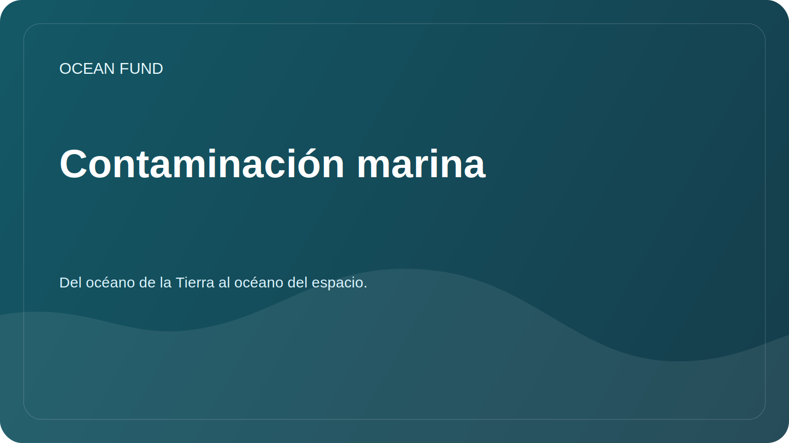

# Contaminación marina

## Enfocar

La contaminación marina incluye plástico, microplásticos, productos derivados del petróleo, productos químicos, aguas residuales, contaminación acústica y otros impactos humanos. La sección ayuda a elaborar un marco de investigación cuidadoso sin afirmaciones no comprobadas.

## Preguntas de investigación

- ¿Qué tipos de contaminación se pueden rastrear utilizando datos abiertos?
- ¿Qué datos requieren observaciones y asociaciones locales?
- ¿Cómo se diferencia entre observación, modelo, evaluación de riesgos y campaña pública?
- ¿Qué visualizaciones son adecuadas para programas educativos?

## Matriz temática

| Sujeto | Datos posibles | Riesgo de interpretación |
| --- | --- | --- |
| Plástico y basura | Observaciones de campo, ciencia ciudadana, informes. | Cobertura incompleta y diferentes técnicas. |
| Contaminación por petróleo | Imágenes satelitales, informes de servicio. | Se requiere verificación de expertos |
| Eutrofización | Clorofila, biogeoquímica, mediciones locales. | No se puede reducir directamente a un indicador |
| Ruido | Mediciones especializadas | Disponibilidad de datos limitada |

## Posibles resultados

- mapa de fuentes y métodos;
- plantilla de tarjeta de caso de contaminación;
- material educativo sobre tipos de contaminación;
- lista de socios para observaciones locales.
