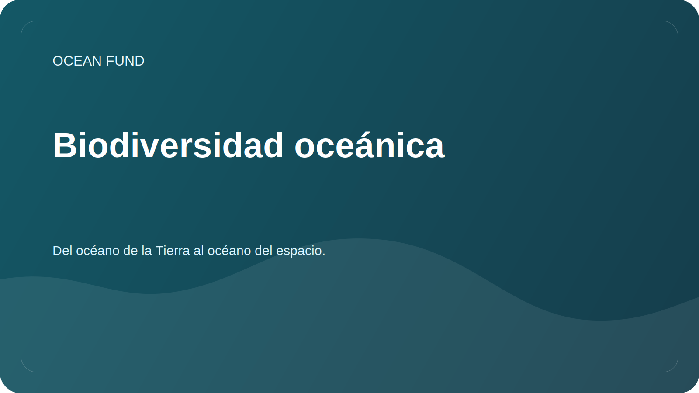

# Biodiversidad oceánica

## Enfocar

El estudio de la biodiversidad marina ayuda a evaluar la salud de los ecosistemas, rastrear los cambios en el hábitat, identificar lagunas en las observaciones y educar a la sociedad sobre el valor del océano.

## Preguntas de investigación

- ¿Qué fuentes abiertas proporcionan datos verificables sobre la presencia de especies marinas?
- ¿Dónde están las brechas de observación entre regiones, profundidades y grupos taxonómicos?
- ¿Qué indicadores se pueden utilizar para los materiales educativos y públicos?
- ¿Cómo visualizar correctamente la biodiversidad sin simplificar el significado científico?

## Fuentes potenciales

| Fuente | Posibles aplicaciones |
| --- | --- |
| OBIS | Ocurrencia de especies, registros taxonómicos, geografía de las observaciones. |
| FathomNet | Imágenes submarinas comentadas y tareas de visión por computadora. |
| GBIF | Contexto adicional sobre biodiversidad si las licencias y la calidad son apropiadas |
| Publicaciones científicas | Metodologías de verificación, términos y limitaciones |

## Posibles resultados

- mapa de fuentes sobre biodiversidad marina;
- lista de indicadores para materiales públicos;
- cuaderno con un ejemplo de carga de registros abiertos;
- Breve resumen para socios para museos y sitios educativos.

## Restricciones

Los datos sobre la presencia de especies pueden estar incompletos y sesgados según la región y el método de observación. Cualquier visualización debe describir claramente la fuente, la fecha de acceso y las restricciones.
