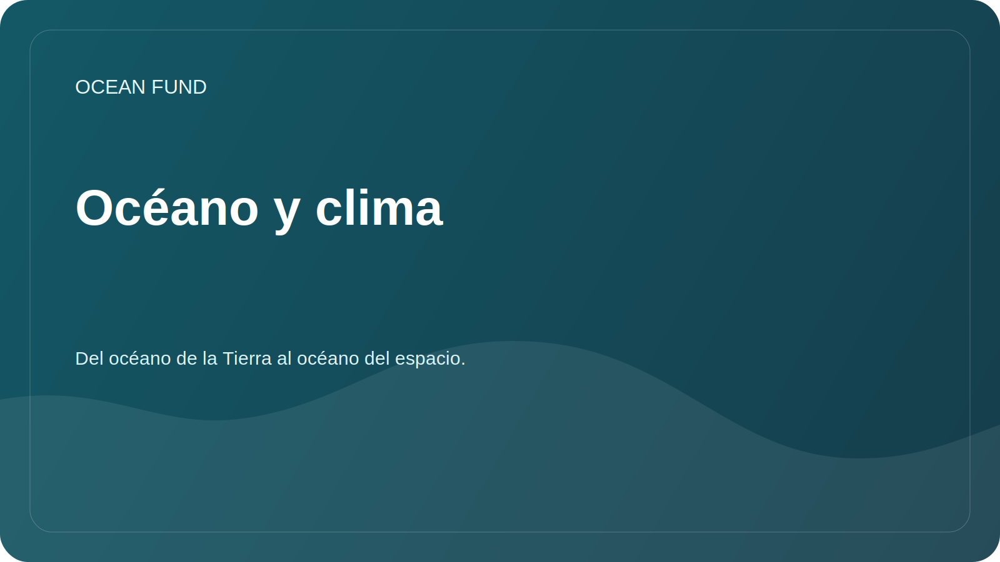

# Océano y clima

## Enfocar

El océano almacena calor, participa en el ciclo del carbono e influye en el clima, las condiciones del hielo, las corrientes y la estabilidad costera. La misión de la fundación en esta área es ayudar a traducir datos climáticos complejos en materiales educativos y de investigación claros.

## Preguntas de investigación

- ¿Qué variables son mejores para los materiales introductorios sobre el océano y el clima?
- ¿Cómo explicamos la temperatura de la superficie del mar, el nivel del mar, el hielo, la salinidad y la clorofila sin simplificar demasiado?
- ¿Qué conjuntos de datos se actualizan periódicamente y son adecuados para portátiles de demostración?
- ¿Cómo mostrar la incertidumbre en modelos y observaciones?

## Fuentes potenciales

| Fuente | variables |
| --- | --- |
| Marinero Copérnico | Temperatura, salinidad, corrientes, nivel del mar, biogeoquímica. |
| NOAA | Observaciones climáticas y oceanográficas. |
| IOOS | Observaciones y boyas regionales. |
| Productos satelitales | Temperatura de la superficie, hielo, color del océano, clorofila. |

## Posibles resultados

- descripción general de las variables climáticas clave;
- visualización de demostración para una región;
- glosario de términos para conferencias públicas;
- Lista de restricciones al trabajar con modelos y datos satelitales.
