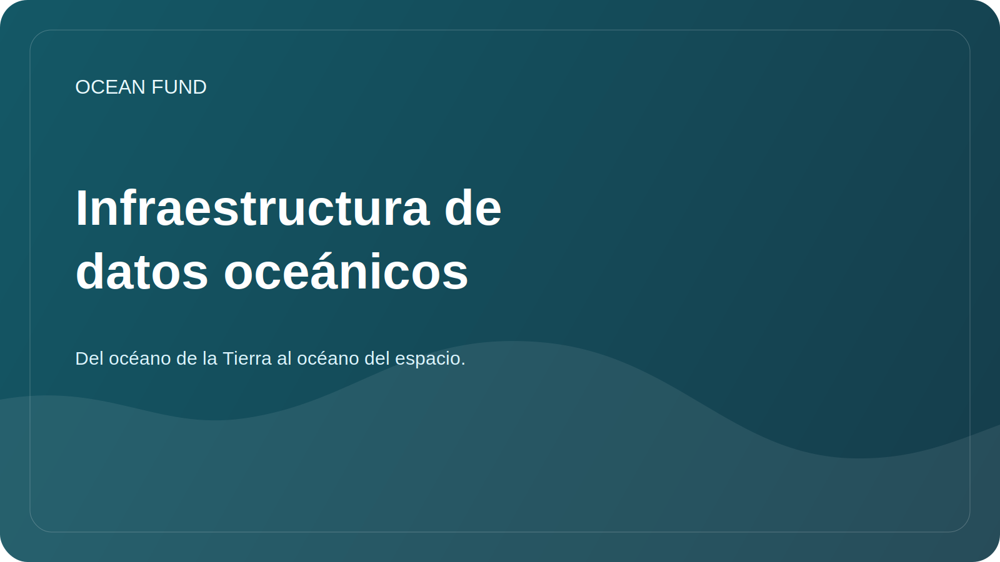

# Infraestructura de datos oceánicos

## Enfocar

La infraestructura de datos es más que solo archivos. Se trata de fuentes, metadatos, licencias, métodos de acceso, versiones, cuadernos, visualizaciones, controles de calidad y reglas de publicación.

## Objetivo

Aclare el trabajo con datos oceánicos para investigadores, desarrolladores, voluntarios y fundaciones asociadas.

## Componentes

| Componente | ¿Por qué es necesario? |
| --- | --- |
| Registro de fuentes | Comprenda rápidamente dónde obtener datos |
| Tarjetas de conjunto de datos | Licencia de registro, cobertura, formato y restricciones. |
| Cuadernos | Mostrar ejemplos de análisis reproducibles |
| Metadatos | Guardar contexto y revisar fecha |
| Reglas de publicación | Prevenir datos privados y conclusiones no confirmadas |

## Primeras tareas

- complete [`datasets-register.md`](../../data/datasets-register.md);
- seleccione un código abierto para el cuaderno de demostración;
- determinar el estándar mínimo para una tarjeta de conjunto de datos;
- describir las reglas para almacenar datos derivados.

## Criterios de calidad

- la fuente está disponible públicamente;
- la licencia es clara;
- fecha de acceso indicada;
- hay una descripción de las restricciones;
- el análisis se puede repetir.
