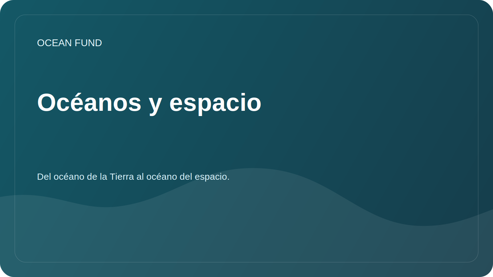

# Océanos y espacio

Estado: `draft`

Esta dirección conecta los océanos de la Tierra con una perspectiva cósmica. La Fundación puede ver el océano no sólo como un sistema natural de la Tierra, sino también como un modelo para el estudio de la habitabilidad, la navegación, los datos, los entornos extremos y la futura diplomacia científica.

## fotograma clave

La Tierra misma es un mundo oceánico. El estudio de sus océanos ayuda a comprender el clima, la vida, los ciclos químicos, la teledetección y los límites de la habitabilidad. Los "mundos oceánicos" cósmicos amplían este marco: Europa, Encelado, Titán y otros cuerpos del sistema solar se analizan a través del agua, el hielo, los océanos internos, la materia orgánica y las fuentes de energía.

## Preguntas de investigación

- ¿Cómo ayudan los métodos oceanográficos a la astrobiología y la ciencia planetaria?
- ¿Qué ambientes marinos extremos terrestres pueden utilizarse como análogos de los océanos cósmicos?
- ¿Cómo vincula la observación oceánica por satélite la ciencia marina y la infraestructura espacial?
- ¿Qué datos de la NASA, ESA, NOAA y Copernicus se pueden utilizar para materiales básicos de educación e investigación?
- ¿Cómo hablar del “espacio como un océano” de manera metafórica, pero científicamente precisa?
- ¿Qué misiones y programas de mundos oceánicos son importantes para la comunicación científica pública?

## Bloques temáticos

| Bloquear | ¿Qué está incluido? | Posible resultado |
| --- | --- | --- |
| La Tierra como un mundo oceánico. | El océano de la Tierra como sistema de clima, vida y datos | informe público |
| Teledetección | Color del océano, temperatura de la superficie, hielo, clorofila. | tarjeta de conjunto de datos, visualización |
| Análogos del océano | Respiraderos hidrotermales, ambientes subglaciales, mares profundos | revisión de análogos |
| Habitabilidad planetaria | Agua, energía, química, materia orgánica, capas de hielo. | glosario y mapa conceptual |
| Misiones de mundos oceánicos | Europa Clipper, herencia de Cassini, futuras misiones | cronograma y resumen del socio |
| Cultura y navegación | El mar y el espacio como entornos de investigación | texto para una conferencia o exposición |

## fuentes primarias

| Fuente | ¿Para qué es? |
| --- | --- |
| Mundos oceánicos de la NASA | revisión de los mundos oceánicos espaciales y las misiones |
| Astrobiología de la NASA | habitabilidad, extremófilos, búsqueda de vida |
| Color del océano de la NASA | datos satelitales sobre el color del océano y la biogeoquímica |
| RITMO DE LA NASA | mediciones modernas del océano, la atmósfera y el clima |
| Marinero Copérnico | Monitoreo regular de las condiciones del océano. |
| NOAA/Argo | observaciones y perfiles oceánicos |
| Observación de la Tierra de la ESA | Observación satelital de la Tierra y el océano. |

## Formatos de resultados

- revisar "La Tierra como mundo oceánico";
- tarjetas fuente NASA Ocean Color, PACE, Copernicus Marine, Argo;
- conferencia "Océano abajo, océano arriba";
- enlaces de visualización: oceanología -> teledetección -> astrobiología -> ciencia pública;
- lista de socios: planetarios, museos de ciencias, laboratorios universitarios, centros de investigación espacial y marina.

## Riesgos de redacción

- No afirmes la presencia de vida en mundos oceánicos cósmicos.
- Separe los datos científicos de la metáfora de que “el espacio es como un océano”.
- Verifique las fechas de la misión y el estado del programa antes de su uso público.
- No confunda analogías educativas con hallazgos científicos probados.
