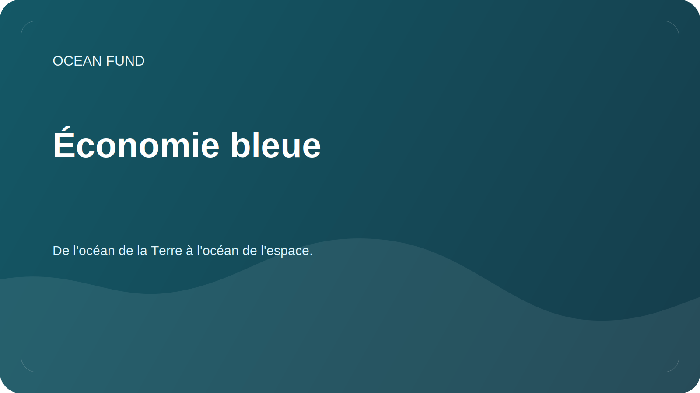

# Économie bleue

## Se concentrer

L'économie bleue décrit les activités économiques liées aux ressources océaniques et en eau d'une manière durable, fondée sur la science et socialement responsable.

La Fondation Océan utilise le terme avec précaution : non pas comme argument de vente, mais comme cadre pour discuter de l’équilibre entre développement, conservation des écosystèmes et bénéfice public.

## Questions

- Quels critères permettent de distinguer les projets maritimes durables des projets déclaratifs ?
- Quelles données sont nécessaires pour évaluer les impacts sur les écosystèmes ?
- Comment les universités, les musées, les fondations et les équipes technologiques peuvent-ils s’impliquer dans l’agenda des océans durables ?
- Quels documents publics aident à expliquer l’économie bleue sans greenwashing ?

## Sujets d’analyse

| Sujet | Résultat possible |
| --- | --- |
| Expédition durable | Aperçu des données, termes et limitations |
| Communautés côtières | Carte des questions pour la recherche de partenaires |
| Technologie marine | Catalogue de solutions avec niveau de préparation et sources |
| Éducation | Matériel pour conférences, expositions et programmes ouverts |

## Restrictions

Les avantages économiques, les perspectives d’investissement ou le statut du projet ne doivent pas être revendiqués sans sources vérifiées et vérification séparée.
