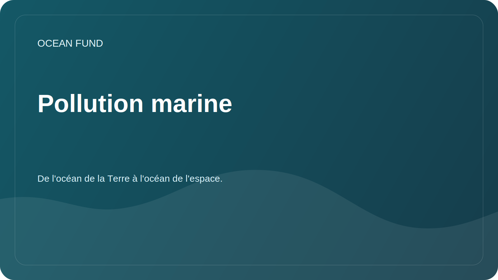

# Pollution marine

## Se concentrer

La pollution marine comprend le plastique, les microplastiques, les produits pétroliers, les produits chimiques, les eaux usées, la pollution sonore et d'autres impacts humains. La section aide à mettre en place un cadre de recherche minutieux sans affirmations non testées.

## Questions de recherche

- Quels types de pollution peuvent être suivis grâce aux données ouvertes ?
- Quelles données nécessitent des observations et des partenariats locaux ?
- Comment faites-vous la différence entre observation, modèle, évaluation des risques et campagne publique ?
- Quelles visualisations conviennent aux programmes éducatifs ?

## Matrice de sujets

| Sujet | Données possibles | Risque d'interprétation |
| --- | --- | --- |
| Plastique et déchets | Observations de terrain, science citoyenne, rapports | Couverture incomplète et techniques différentes |
| Pollution pétrolière | Images satellite, rapports de service | Vérification par un expert requise |
| Eutrophisation | Chlorophylle, biogéochimie, mesures locales | Ne peut pas être directement réduit à un seul indicateur |
| Bruit | Mesures spécialisées | Disponibilité limitée des données |

## Résultats possibles

- carte des sources et des méthodes ;
- modèle de fiche de cas de pollution ;
- matériel pédagogique sur les types de pollution;
- liste de partenaires pour les observations locales.
