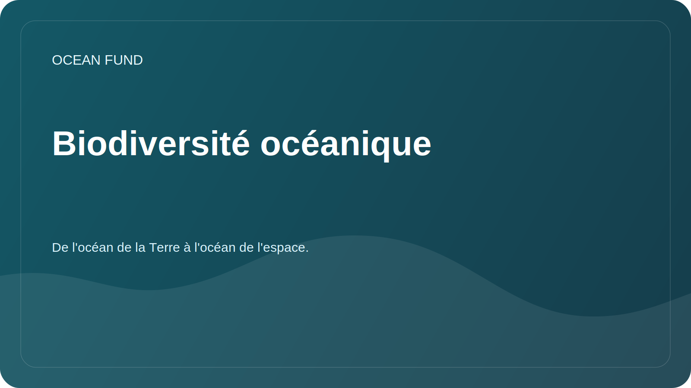

# Biodiversité océanique

## Se concentrer

L'étude de la biodiversité marine permet d'évaluer la santé des écosystèmes, de suivre les changements dans les habitats, d'identifier les lacunes dans les observations et d'éduquer la société sur la valeur de l'océan.

## Questions de recherche

- Quelles sources ouvertes fournissent des données vérifiables sur la présence d’espèces marines ?
- Où se situent les lacunes d’observation entre les régions, les profondeurs et les groupes taxonomiques ?
- Quels indicateurs peuvent être utilisés pour les matériels éducatifs et publics ?
- Comment visualiser correctement la biodiversité sans simplifier le sens scientifique ?

## Sources potentielles

| Source | Applications possibles |
| --- | --- |
| OBIS | Occurrence des espèces, enregistrements taxonomiques, géographie des observations |
| FathomNet | Images sous-marines annotées et tâches de vision par ordinateur |
| GBIF | Contexte supplémentaire sur la biodiversité si les licences et la qualité sont appropriées |
| Publications scientifiques | Méthodologies de vérification, termes et limitations |

## Résultats possibles

- carte des sources sur la biodiversité marine ;
- liste d'indicateurs pour les documents publics ;
- cahier avec un exemple de chargement d'enregistrements ouverts ;
- court brief partenaire pour les musées et les sites éducatifs.

## Restrictions

Les données sur l’occurrence des espèces peuvent être incomplètes et biaisées selon la région et la méthode d’observation. Toute visualisation doit décrire clairement la source, la date d'accès et les restrictions.
