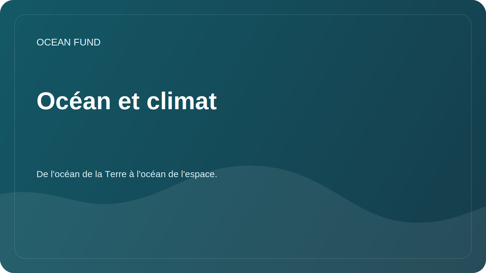

# Océan et climat

## Se concentrer

L'océan emmagasine la chaleur, participe au cycle du carbone et influence les conditions météorologiques, l'état des glaces, les courants et la stabilité des côtes. La mission de la fondation dans ce domaine est d'aider à traduire des données climatiques complexes en matériels de recherche et pédagogiques soignés.

## Questions de recherche

- Quelles variables conviennent le mieux aux documents d’introduction sur l’océan et le climat ?
- Comment expliquer la température de la surface de la mer, le niveau de la mer, la glace, la salinité et la chlorophylle sans trop simplifier ?
- Quels ensembles de données sont mis à jour régulièrement et conviennent aux notebooks de démonstration ?
- Comment montrer l’incertitude dans les modèles et les observations ?

## Sources potentielles

| Source | Variables |
| --- | --- |
| Copernic Marin | Température, salinité, courants, niveau de la mer, biogéochimie |
| NOAA | Observations climatiques et océanographiques |
| IOOS | Observations régionales et bouées |
| Produits satellites | Température de surface, glace, couleur de l'océan, chlorophylle |

## Résultats possibles

- aperçu des principales variables climatiques ;
- visualisation de démonstration pour une région ;
- glossaire des termes pour les conférences publiques ;
- liste des restrictions lors de l'utilisation de modèles et de données satellite.
