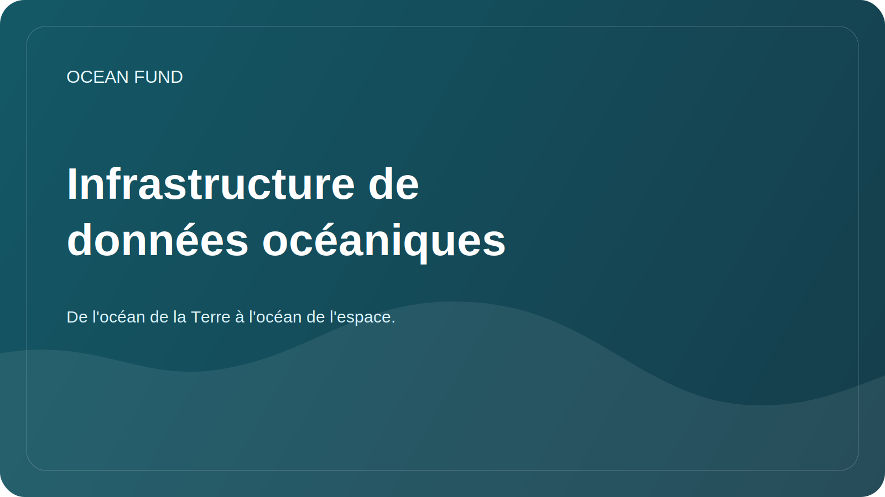

# Infrastructure de données océaniques

## Se concentrer

L’infrastructure de données ne se résume pas à de simples fichiers. Il s'agit des sources, des métadonnées, des licences, des méthodes d'accès, des versions, des notebooks, des visualisations, des contrôles de qualité et des règles de publication.

## Cible

Rendez clair le travail avec les données océaniques pour les chercheurs, les développeurs, les bénévoles et les fondations partenaires.

## Composants

| Composant | Pourquoi est-ce nécessaire ? |
| --- | --- |
| Registre des sources | Comprenez rapidement où obtenir des données |
| Cartes d'ensemble de données | Licence d'enregistrement, couverture, format et restrictions |
| Carnets | Afficher des exemples d'analyse reproductibles |
| Métadonnées | Enregistrer le contexte et la date de révision |
| Règles de publication | Empêcher les données privées et les conclusions non confirmées |

## Premières tâches

- remplissez [`data/datasets-register.md`](../../data/datasets-register.md);
- sélectionnez-en un open source pour le bloc-notes de démonstration ;
- déterminer la norme minimale pour une carte d'ensemble de données ;
- décrire les règles de stockage des données dérivées.

## Critères de qualité

- la source est accessible au public ;
- la licence est claire ;
- date d'accès indiquée ;
- il y a une description des restrictions ;
- l'analyse peut être répétée.
