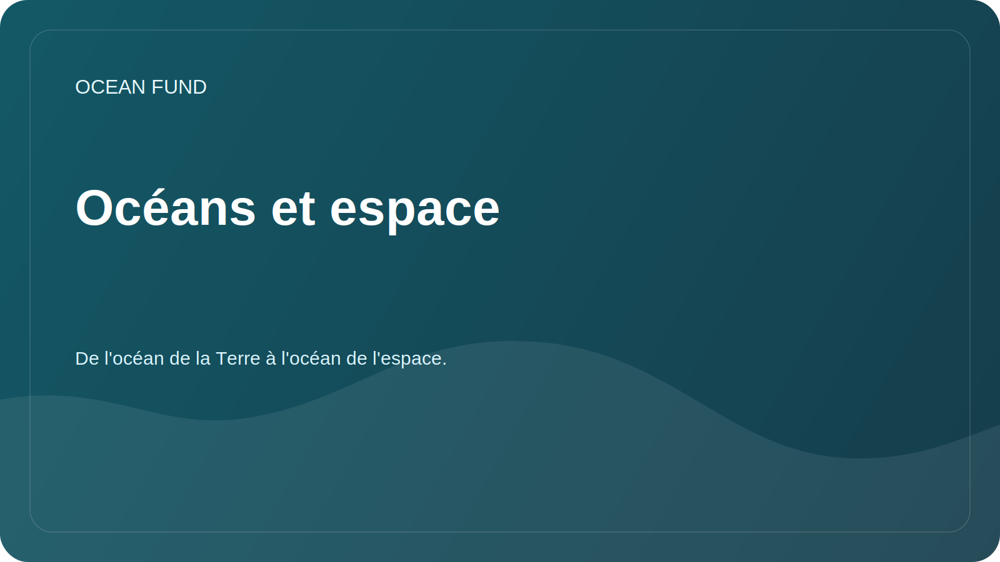

# Mondes océaniques et espace

Statut : `draft`

Cette direction relie les océans de la Terre à une perspective cosmique. La Fondation peut considérer l’océan non seulement comme un système naturel de la Terre, mais également comme un modèle pour l’étude de l’habitabilité, de la navigation, des données, des environnements extrêmes et de la future diplomatie scientifique.

## Image clé

La Terre elle-même est un monde océanique. L'étude de ses océans permet de comprendre le climat, la vie, les cycles chimiques, la télédétection et les limites de l'habitabilité. Les « mondes océaniques » cosmiques élargissent ce cadre : Europe, Encelade, Titan et d'autres corps du système solaire sont abordés à travers l'eau, la glace, les océans internes, les matières organiques et les sources d'énergie.

## Questions de recherche

- Comment les méthodes océanographiques aident-elles l’astrobiologie et les sciences planétaires ?
- Quels environnements marins terrestres extrêmes peuvent être utilisés comme analogues des océans cosmiques ?
- Comment l’observation satellitaire des océans relie-t-elle les sciences marines et les infrastructures spatiales ?
- Quelles données de la NASA, de l'ESA, de la NOAA et de Copernicus peuvent être utilisées pour le matériel pédagogique et de recherche des fondations ?
- Comment parler de « l’espace comme océan » de manière métaphorique, mais scientifiquement précise ?
- Quels missions et programmes océaniques sont importants pour la communication scientifique publique ?

## Blocs thématiques

| Bloc | Ce qui est inclus | Résultat possible |
| --- | --- | --- |
| La Terre comme monde océanique | L'océan terrestre en tant que système de climat, de vie et de données | mémoire public |
| Télédétection | Couleur de l'océan, température de surface, glace, chlorophylle | carte de jeu de données, visualisation |
| Analogues océaniques | Sources hydrothermales, milieux sous-glaciaires, eaux profondes | examen des analogues |
| Habitabilité planétaire | Eau, énergie, chimie, matières organiques, coquilles de glace | glossaire et carte conceptuelle |
| Missions des mondes océaniques | Europa Clipper, héritage Cassini, missions futures | chronologie et brief du partenaire |
| Culture et navigation | La mer et l'espace comme environnements de recherche | texte pour une conférence ou une exposition |

## Sources primaires

| Source | A quoi ça sert ? |
| --- | --- |
| Mondes océaniques de la NASA | examen des mondes et des missions spatiaux-océaniques |
| Astrobiologie de la NASA | habitabilité, extrémophiles, recherche de la vie |
| Couleur de l'océan de la NASA | données satellitaires sur la couleur des océans et la biogéochimie |
| RYTHME DE LA NASA | mesures modernes de l'océan, de l'atmosphère et du climat |
| Copernic Marin | surveillance régulière des conditions océaniques |
| NOAA/Argo | observations et profils océaniques |
| Observation de la Terre par l'ESA | observation par satellite de la Terre et de l'océan |

## Formats de résultats

- revue « La Terre en tant que monde océanique » ;
- cartes sources NASA Ocean Color, PACE, Copernicus Marine, Argo ;
- conférence « Océan en bas, océan au-dessus » ;
- liens de visualisation : océanologie -> télédétection -> astrobiologie -> science publique ;
- liste des partenaires : planétariums, musées des sciences, laboratoires universitaires, centres de recherche spatiale et marine.

## Risques de formulation

- N’affirmez pas la présence de vie sur les mondes océaniques cosmiques.
- Séparez les données scientifiques de la métaphore « l’espace est comme un océan ».
- Vérifiez les dates de mission et l’état du programme avant toute utilisation publique.
- Ne confondez pas les analogies pédagogiques avec les découvertes scientifiques avérées.
