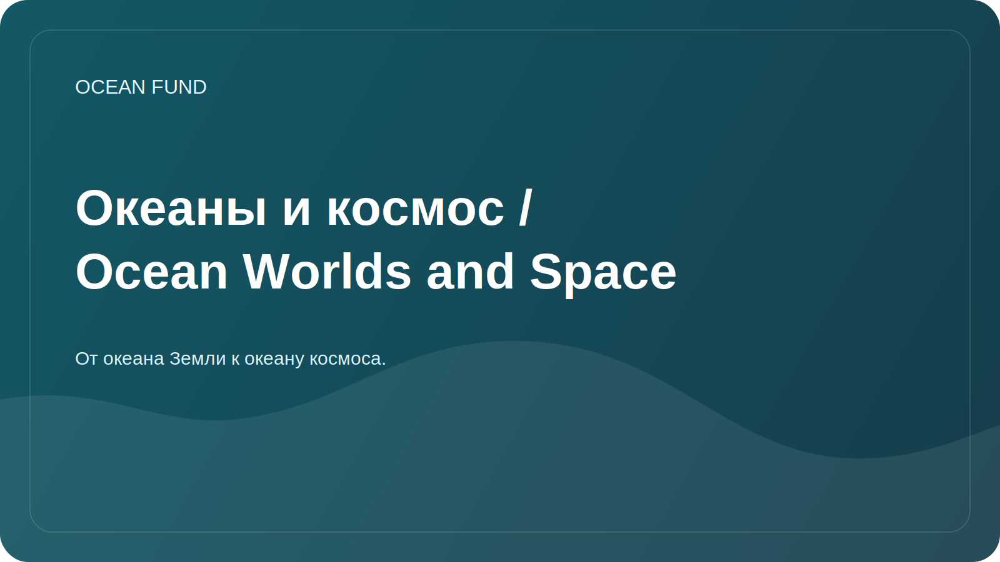

# Океаны и космос / Ocean Worlds and Space

Статус: `draft`

Это направление связывает земной океан с космической перспективой. Фонд может рассматривать океан не только как природную систему Земли, но и как модель для изучения обитаемости, навигации, данных, экстремальных сред и будущей научной дипломатии.

## Ключевая рамка

Земля сама является океаническим миром. Изучение ее океана помогает понимать климат, жизнь, химические циклы, дистанционное зондирование и пределы обитаемости. Космические "океанические миры" расширяют эту рамку: Европа, Энцелад, Титан и другие тела Солнечной системы обсуждаются через воду, лед, внутренние океаны, органику и энергетические источники.

## Исследовательские вопросы

- Как методы океанологии помогают астробиологии и планетологии?
- Какие земные экстремальные морские среды можно использовать как аналоги космических океанов?
- Как спутниковое наблюдение океана связывает морскую науку и космическую инфраструктуру?
- Какие данные NASA, ESA, NOAA и Copernicus можно использовать для образовательных и исследовательских материалов фонда?
- Как говорить о "космосе как океане" метафорически, но научно аккуратно?
- Какие миссии и программы по ocean worlds важны для публичной научной коммуникации?

## Тематические блоки

| Блок | Что входит | Возможный результат |
| --- | --- | --- |
| Earth as an ocean world | Океан Земли как система климата, жизни и данных | публичный brief |
| Remote sensing | Цвет океана, температура поверхности, лед, хлорофилл | dataset card, визуализация |
| Ocean analogs | Гидротермальные источники, подледные среды, глубоководье | обзор аналогов |
| Planetary habitability | Вода, энергия, химия, органика, ледяные оболочки | глоссарий и карта понятий |
| Ocean worlds missions | Europa Clipper, Cassini heritage, будущие миссии | timeline и partner brief |
| Culture and navigation | Море и космос как среды исследования | текст для лекции или выставки |

## Первичные источники

| Источник | Для чего нужен |
| --- | --- |
| NASA Ocean Worlds | обзор космических океанических миров и миссий |
| NASA Astrobiology | обитаемость, экстремофилы, поиск жизни |
| NASA Ocean Color | спутниковые данные о цвете океана и биогеохимии |
| NASA PACE | современные измерения океана, атмосферы и климата |
| Copernicus Marine | регулярный мониторинг состояния океана |
| NOAA / Argo | наблюдения и профили океана |
| ESA Earth Observation | спутниковое наблюдение Земли и океана |

## Форматы результата

- обзор "Земля как океанический мир";
- карточки источников NASA Ocean Color, PACE, Copernicus Marine, Argo;
- лекция "Океан внизу, океан наверху";
- визуализация связи: океанология -> remote sensing -> astrobiology -> public science;
- список партнеров: планетарии, музеи науки, университетские лаборатории, космические и морские исследовательские центры.

## Риски формулировок

- Не утверждать наличие жизни на космических океанических мирах.
- Отделять научные данные от метафоры "космос как океан".
- Проверять даты миссий и статус программ перед публичным использованием.
- Не смешивать образовательные аналогии с доказанными научными выводами.
