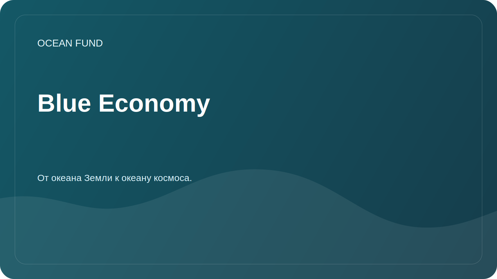

# Blue Economy

## Фокус

Blue economy описывает экономическую деятельность, связанную с океаном и водными ресурсами, при условии устойчивого, научно обоснованного и социально ответственного подхода.

Фонд «Океан» использует этот термин осторожно: не как рекламный лозунг, а как рамку для обсуждения баланса между развитием, сохранением экосистем и общественной пользой.

## Вопросы

- Какие критерии позволяют отличать устойчивые морские проекты от декларативных?
- Какие данные нужны для оценки воздействия на экосистемы?
- Как университеты, музеи, фонды и технологические команды могут участвовать в устойчивой океанической повестке?
- Какие публичные материалы помогают объяснять blue economy без greenwashing?

## Темы для анализа

| Тема | Возможный результат |
| --- | --- |
| Устойчивое судоходство | Обзор данных, терминов и ограничений |
| Прибрежные сообщества | Карта вопросов для партнерских исследований |
| Морские технологии | Каталог решений с уровнем готовности и источниками |
| Образование | Материалы для лекций, выставок и открытых программ |

## Ограничения

Не следует заявлять экономический эффект, инвестиционные перспективы или статус проекта без подтвержденных источников и отдельной проверки.
