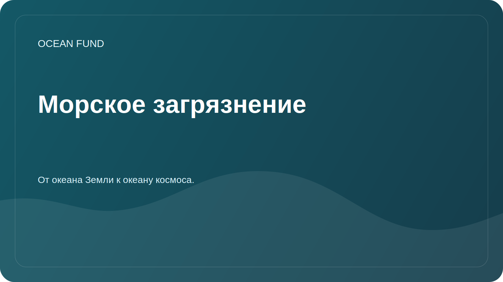

# Морское загрязнение

## Фокус

Морское загрязнение включает пластик, микропластик, нефтепродукты, химические вещества, сточные воды, шумовое загрязнение и другие антропогенные воздействия. Раздел помогает собрать осторожную исследовательскую рамку без непроверенных заявлений.

## Исследовательские вопросы

- Какие типы загрязнения можно отслеживать по открытым данным?
- Какие данные требуют локальных наблюдений и партнерств?
- Как различать наблюдение, модель, оценку риска и публичную кампанию?
- Какие визуализации подходят для образовательных программ?

## Матрица тем

| Тема | Возможные данные | Риск интерпретации |
| --- | --- | --- |
| Пластик и мусор | Полевые наблюдения, citizen science, отчеты | Неполное покрытие и разные методики |
| Нефтяное загрязнение | Спутниковые снимки, отчеты служб | Требуется экспертная верификация |
| Эвтрофикация | Хлорофилл, биогеохимия, локальные измерения | Нельзя напрямую сводить к одному показателю |
| Шум | Специализированные измерения | Ограниченная доступность данных |

## Возможные результаты

- карта источников и методик;
- шаблон карточки кейса загрязнения;
- образовательный материал о типах загрязнения;
- список партнеров для локальных наблюдений.
