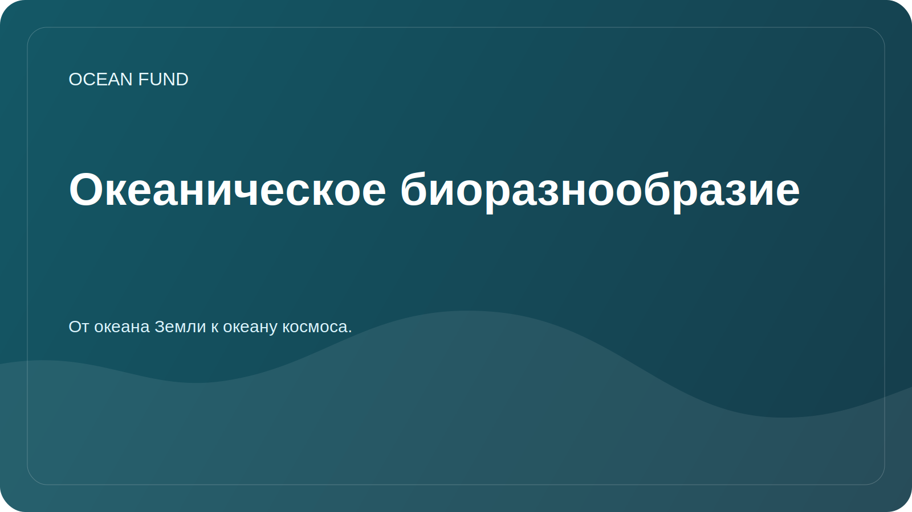

# Океаническое биоразнообразие

## Фокус

Изучение морского биоразнообразия помогает оценивать состояние экосистем, отслеживать изменения ареалов, выявлять пробелы в наблюдениях и объяснять обществу ценность океана.

## Исследовательские вопросы

- Какие открытые источники дают проверяемые данные о встречаемости морских видов?
- Где видны пробелы наблюдений по регионам, глубинам и таксономическим группам?
- Какие индикаторы можно использовать для образовательных и публичных материалов?
- Как корректно визуализировать биоразнообразие без упрощения научного смысла?

## Потенциальные источники

| Источник | Возможное применение |
| --- | --- |
| OBIS | Встречаемость видов, таксономические записи, география наблюдений |
| FathomNet | Аннотированные подводные изображения и задачи компьютерного зрения |
| GBIF | Дополнительный контекст по биоразнообразию, если лицензии и качество подходят |
| Научные публикации | Проверка методик, терминов и ограничений |

## Возможные результаты

- карта источников по морскому биоразнообразию;
- список индикаторов для публичных материалов;
- notebook с примером загрузки открытых записей;
- короткий partner brief для музеев и образовательных площадок.

## Ограничения

Данные о встречаемости видов могут быть неполными, смещенными по регионам и методам наблюдения. Любая визуализация должна явно описывать источник, дату доступа и ограничения.
