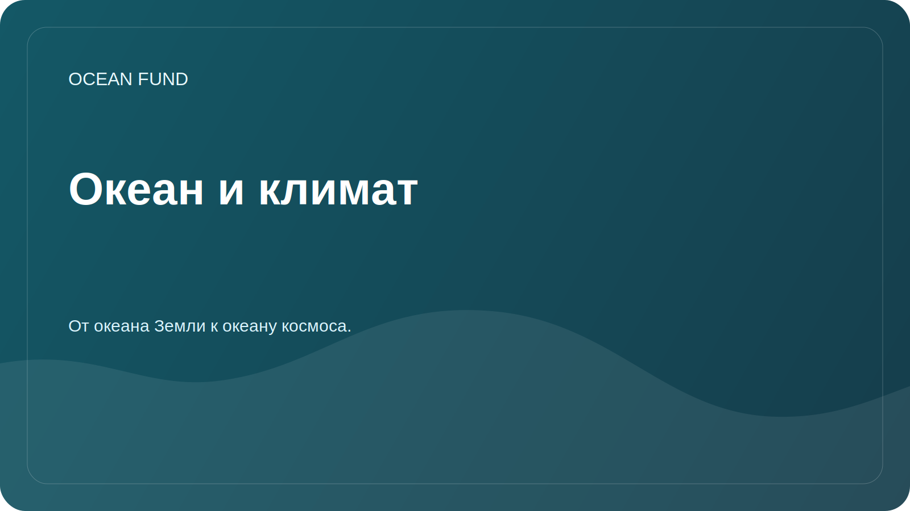

# Океан и климат

## Фокус

Океан накапливает тепло, участвует в углеродном цикле, влияет на погоду, ледовые условия, течения и устойчивость прибрежных территорий. Задача фонда в этом направлении — помогать переводить сложные климатические данные в аккуратные исследовательские и образовательные материалы.

## Исследовательские вопросы

- Какие переменные лучше всего подходят для вводных материалов об океане и климате?
- Как объяснять температуру поверхности моря, уровень моря, лед, соленость и хлорофилл без чрезмерных упрощений?
- Какие наборы данных обновляются регулярно и пригодны для демонстрационных notebooks?
- Как показывать неопределенность моделей и наблюдений?

## Потенциальные источники

| Источник | Переменные |
| --- | --- |
| Copernicus Marine | Температура, соленость, течения, уровень моря, биогеохимия |
| NOAA | Климатические и океанографические наблюдения |
| IOOS | Региональные наблюдения и буи |
| Спутниковые продукты | Температура поверхности, лед, цвет океана, хлорофилл |

## Возможные результаты

- обзор ключевых климатических переменных;
- демонстрационная визуализация по одному региону;
- глоссарий терминов для публичных лекций;
- список ограничений при работе с моделями и спутниковыми данными.
