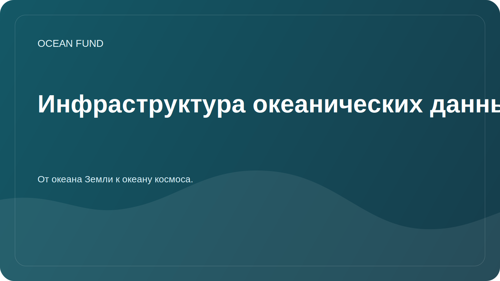

# Инфраструктура океанических данных

## Фокус

Инфраструктура данных — это не только файлы. Это источники, метаданные, лицензии, способы доступа, версии, notebooks, визуализации, проверки качества и правила публикации.

## Цель

Сделать работу с океаническими данными понятной для исследователей, разработчиков, волонтеров и партнеров фонда.

## Компоненты

| Компонент | Зачем нужен |
| --- | --- |
| Реестр источников | Быстро понять, где брать данные |
| Карточки датасетов | Зафиксировать лицензию, покрытие, формат и ограничения |
| Notebooks | Показать воспроизводимые примеры анализа |
| Метаданные | Сохранить контекст и дату проверки |
| Правила публикации | Не допустить приватных данных и неподтвержденных выводов |

## Первые задачи

- заполнить [`data/datasets-register.md`](../data/datasets-register.md);
- выбрать один открытый источник для демонстрационного notebook;
- определить минимальный стандарт карточки датасета;
- описать правила хранения производных данных.

## Критерии качества

- источник доступен публично;
- лицензия понятна;
- указана дата доступа;
- есть описание ограничений;
- анализ можно повторить.
