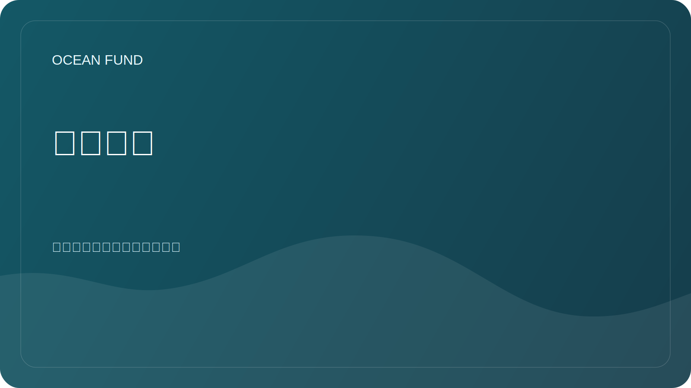

# 海洋污染

## 重点

海洋污染包括塑料、微塑料、石油产品、化学品、污水、噪音污染和其他人类影响。该部分有助于构建一个仔细的研究框架，而无需未经检验的主张。

## 研究问题

- 使用开放数据可以跟踪哪些类型的污染？
- 哪些数据需要当地观察和合作？
- 您如何区分观察、模型、风险评估和公共活动？
- 哪些可视化适合教育项目？

## 主题矩阵

| 主题 | 可能的数据 | 解释风险 |
| --- | --- | --- |
| 塑料和垃圾 | 实地观察、公民科学、报告 | 覆盖不完整和不同的技术 |
| 石油污染 | 卫星图像、服务报告 | 需要专家验证 |
| 富营养化 | 叶绿素、生物地球化学、局部测量 | 不能直接简化为一项指标 |
| 噪音 | 专业测量 | 数据可用性有限 |

## 可能的结果

- 来源和方法图；
- 污染案例卡模板；
- 有关污染类型的教育材料；
- 当地观察合作伙伴名单。
