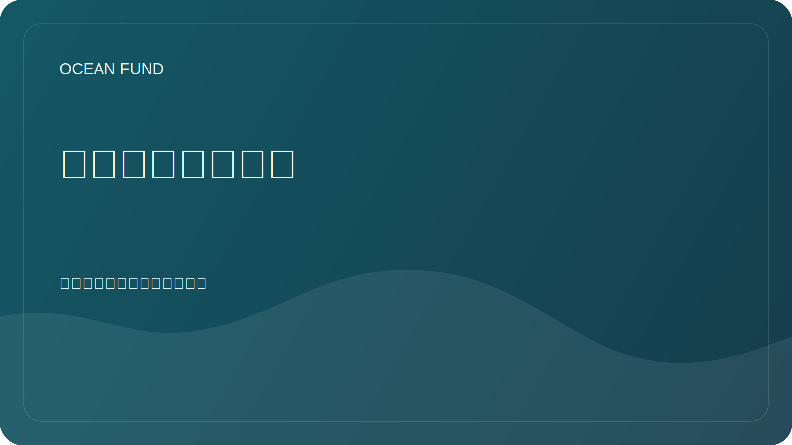

# 海洋数据基础设施

## 重点

数据基础设施不仅仅是文件。这些是来源、元数据、许可证、访问方法、版本、笔记本、可视化、质量检查和发布规则。

## 目标

让研究人员、开发人员、志愿者和基金会合作伙伴清楚地了解如何使用海洋数据。

## 成分

| 成分 | 为什么需要它？ |
| --- | --- |
| 来源登记 | 快速了解从哪里获取数据 |
| 数据集卡 | 记录许可、覆盖范围、格式和限制 |
| 笔记本电脑 | 显示可重复的分析示例 |
| 元数据 | 保存上下文和审核日期 |
| 出版规则 | 防止私人数据和未经证实的结论 |

## 第一个任务

- 填写[`datasets-register.md`](../../data/datasets-register.md);
- 为演示笔记本选择一个开源；
- 确定数据集卡的最低标准；
- 描述存储派生数据的规则。

## 质量标准

- 来源是公开的；
- 许可证清晰；
- 注明访问日期；
- 有限制的描述；
- 可以重复分析。
